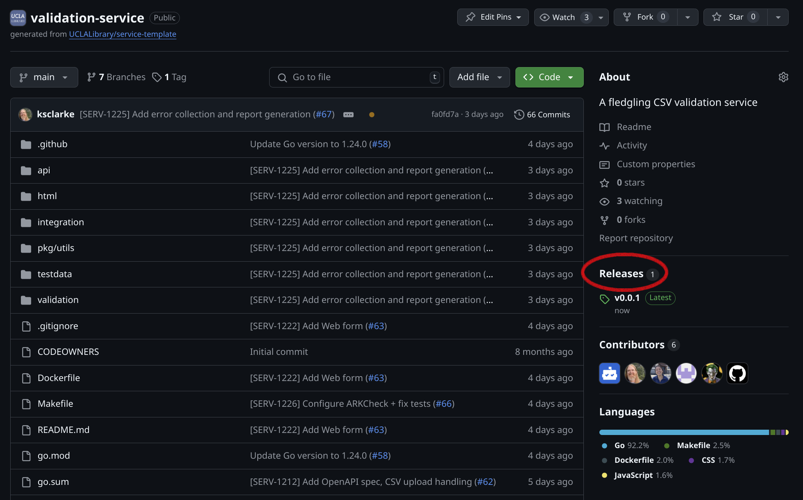
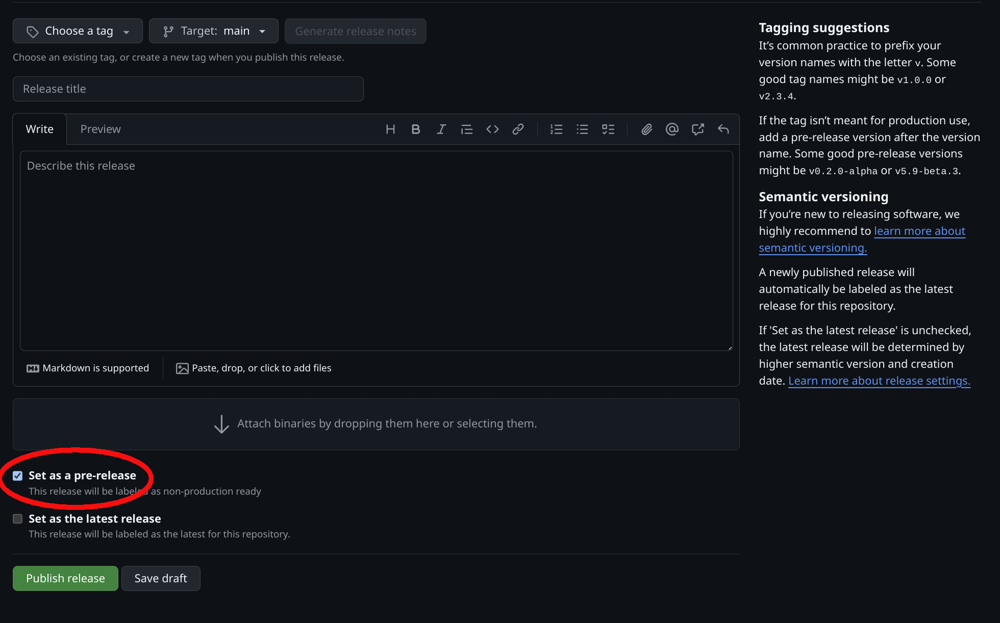
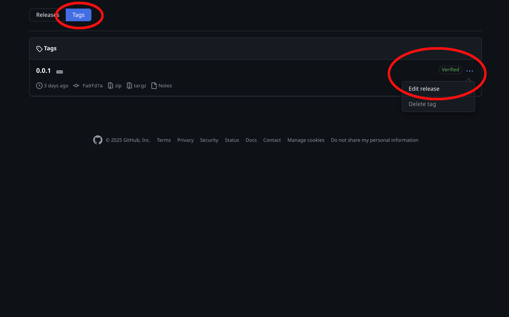
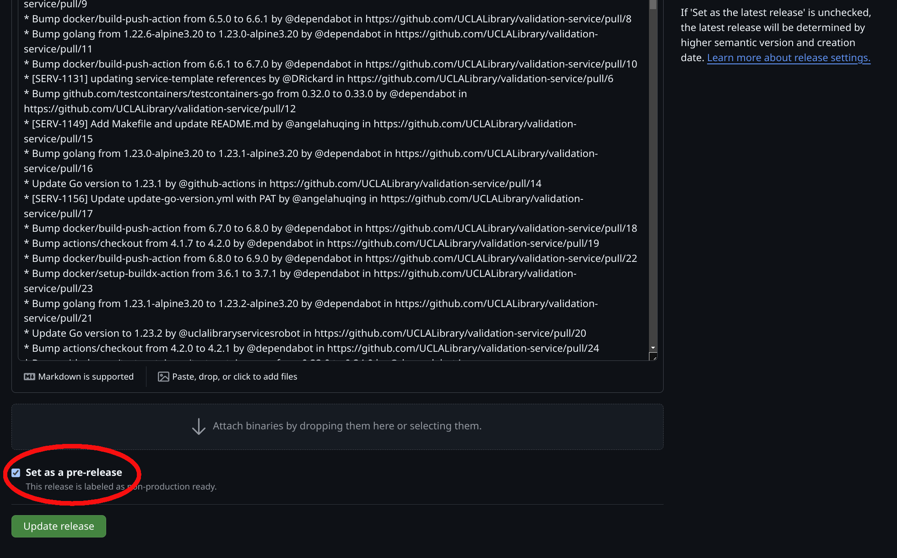

# How to Deploy

Deploying new versions of the `validation-service` is done through GitHub's UI and the 'release.yml' GitHub Action. It
starts with the release link over on the right side of the project's home screen. Click that link to start a new release.

The new release should use a tag in the form of `0.0.1`. The title of the release should be in the form `v0.0.1`. The
"Generate release notes" button can be clicked to pull in the changes made since the last release. Once this has all
been done, make sure to click the "Set as pre-release" checkbox on the lower left side of the screen. This is very
important because it ensures that the Docker image is deployed to a test server before being deployed to production.

Once the Docker image has been automatically deployed to the test server (through the magic of ArgoCD), it can be
tested before the final step. In the final step, you will go back to the Releases GitHub page and click on the "Tags"
toggle. This will open a screen with a list of all the tags. To the right of the tag you want to promote from test to
production will be three dots. If you click on them, a dropdown will open. One of the options in the dropdown will be
"Edit release".

Select the "Edit release" link and the release form will open again. This time, all the information (e.g., tag, title,
etc.) will be previously filled in. To make the change to deploy to production instead of test, uncheck the "Set as
prerelease" checkbox and click the green "Update release" button. Once this is done, and ArgoCD has had a chance to run,
the Docker image will be deployed to the production server.

If you have access to the Library's ArgoCD server, you can login there to confirm that the service has been successfully
deployed.
